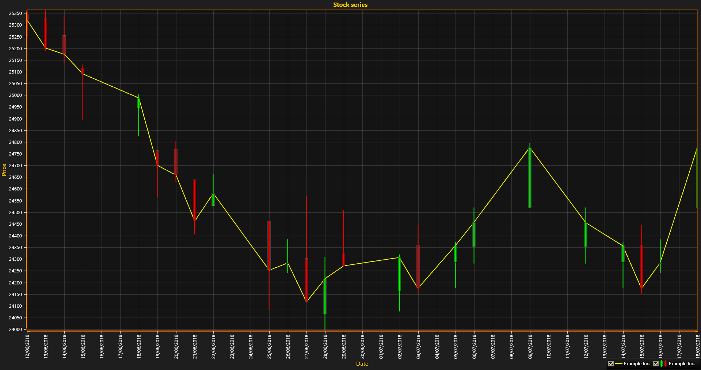

# Presenting Financial Data with StockSeries

This tutorial explains how to load financial data from a CSV file and display it using *LightningChart StockSeries*. Stock series are used to visualize stock exchange data in candlestick and stock bars formats. The tutorial assumes that you have created a new chart with *LightningChart* on a WinForms or WPF application. If not, please follow our [Simple 2D Chart](https://www.arction.com/tutorials/#/lcu_tutorial_simple2Dchart_01) on creating an application. 



#####  1. Define variables for X- and Y-axis and configure X-axis to display values as dates.

```csharp
// Configure X- and Y-axes.

// X-axis configuration.
var xAxis = chart.ViewXY.XAxes[0];
xAxis.Title.Text = "Date";
xAxis.ValueType = AxisValueType.DateTime;
xAxis.LabelsAngle = 90;
xAxis.MajorDiv = 24 * 60 * 60; //Major division is one day in seconds

// Y-axis configuration.
var yAxis = chart.ViewXY.YAxes[0];
yAxis.Title.Text = "Price";
```

##### 2. Create a new StockSeries to hold the stock information.

```csharp
// Create a new StockSeries.
var stockSeries = new StockSeries(chart.ViewXY, xAxis, yAxis);
chart.ViewXY.StockSeries.Add(stockSeries);
```

##### 3. Configure the stock plot.

```csharp
// Configure the stock plot.
stockSeries.Style = StockStyle.OptimizedCandleStick;
stockSeries.FillBorder.Width = 1;
stockSeries.Title.Text = "Example Inc.";
```

##### 4. Load the data.

Load the data from a CSV file into the series data points using `series.LoadFromCSV(string fileName, SeparatorCSV separator)`. The data has to be organized in columns in the following order:
    
|   Date   |   Open   |   Close   |   High   |   Low   |  Value  |  Transaction|
| -------- |:--------:|:---------:|:--------:|:-------:|:-------:|-----------:|
| DateTime |  double  |   double  |  double  | double  |   int   |   double   |

Series values can be written into a file using `series.SaveToCSV`, which is a pair function for LoadFromCSV.

```csharp
stockSeries.LoadFromCSV("../../../data/data.csv", SeparatorCSV.Semicolon);
```

##### 5. Create a reference to the loaded data points.

```csharp
// Create a reference to the loaded data points.
var stockData = stockSeries.DataPoints;
```

##### 6. Generate data for series which matches closed values.

```csharp
// Generate data for series, which matches closed values.
var closeData = new SeriesPoint[stockData.Length];
for (var i = 0; i < stockData.Length; i++)
{
    closeData[i] = new SeriesPoint()
    {
        X = xAxis.DateTimeToAxisValue(stockData[i].Date),
        Y = stockData[i].Close
    };
}
```

##### 7. Create a new PointLineSeries to show the dynamic in closed values on Stock Exchange.

```csharp
// Create a new PointLineSeries to show the dynamic in closed values on Stock Exchange.
var lineSeries = new PointLineSeries();
lineSeries.Title.Text = "Example Inc.";
lineSeries.Points = closeData;
chart.ViewXY.PointLineSeries.Add(lineSeries);
```

##### 8. Auto-scale axes to show all series data.

```csharp
//Auto-scale X- and Y-axes.
chart.ViewXY.ZoomToFit();
```
